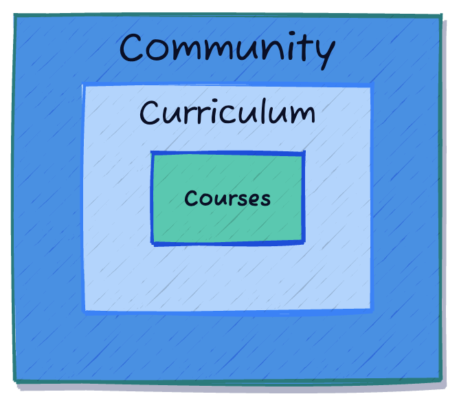

# 2025 Summer Leadership Institute for Computational Education (in Physics) - Strategic Planning

## UW - River Falls (June 27, 2025)

---

# Thank you from the 2025 PICUP Camp Staff

## Big thanks to UWRF and their wonderful staff for hosting us!

---

# We want to hear from you (for ~10 minutes)

- What do you want the next SLICE to focus on?
- How would you like the agenda to be changed?
    - More posters? 
    - Different pre-meeting prep? 
    - Planning your own workshops or activities? 
    - Other forms of sharing together?

## Add your ideas to the Discussion Board.

# We hope you can come back next year!

---

# Project Goals

- to **improve the undergraduate physics curriculum** by implementing the American Physical Society (APS) and American Association of Physics Teachers (AAPT) curricular recommendations through a **vibrant, supportive community-building effort**;
- to **develop the PICUP Resources Archive and Exercise Sets Collection** beyond their fledgling state into a widely-used resource that will **impact undergraduate physics curricula nationwide**; and
- to **develop a series of evidence-based lessons, guides, and instructional aids** that support a variety of assessment practices and approaches for computational physics learning.

---

# Organizing Framework

- **Community**: Building a supportive network of physics educators passionate about integrating computing into physics education.
- **Curriculum**: Developing and sharing high-quality, open-source instructional materials and student-centered pedagogical approaches.
- **Courses**: Integrating computing into physics courses at any level, from introductory to advanced.

---

# Time to Reflect

## Let's take 5-10 minutes to reflect on this last week.

- Without talking to folks at your table, what were the five most important things you learned or did this week?
- Try to select at least one thing from each frame of the Community, Curriculum, and Courses framework.

## Add your ideas to the Discussion Board.

---

# Time to Share

## Let's take 10-15 minutes to share our reflections.

- Share your reflections with your table.
- Together, develop the five most important ideas for our community to focus on
- Think about our goals and framework

## Have one person add these to the Discussion Board. 

---

# Let's take those ideas and make them actionable!

- For each idea that you found important to our community, what activities, actions, materials, or other things would move that idea along?
- Are there short-term actions we can take?
- Are there long-term plans we can develop?
- How would we measure success?
- How do you want to be involved?

## Add your actionable ideas to the Discussion Board.

---

# Thank You!

Additional Questions?