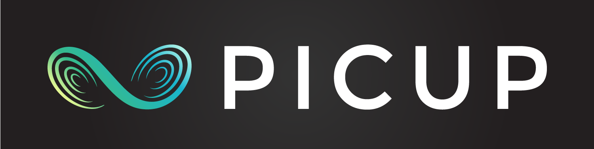
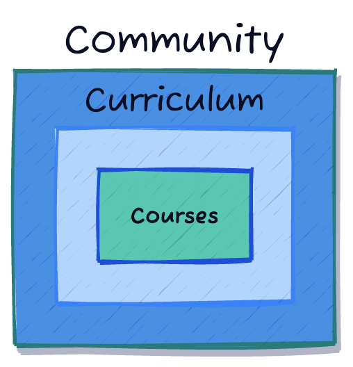
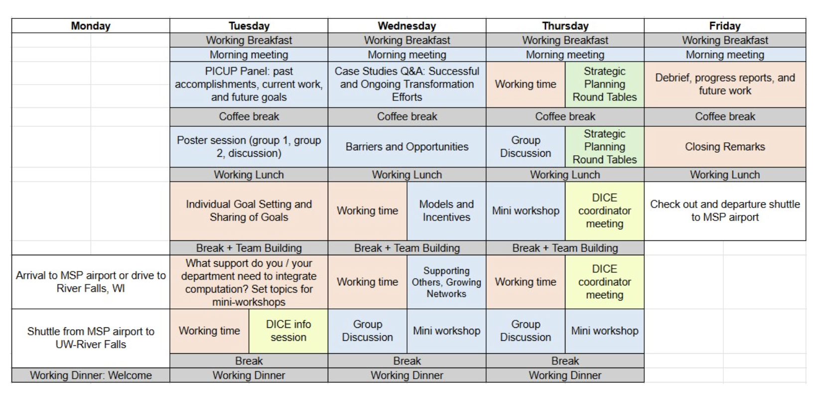

# 2025 Summer Leadership Institute for Computational Education (in Physics) 

## UW - River Falls (June 23-27)

---

# Project Goals

- to improve the undergraduate physics curriculum by implementing the American Physical Society (APS) and American Association of Physics Teachers (AAPT) curricular recommendations through a vibrant, supportive community-building effort;
- to develop the PICUP Resources Archive and Exercise Sets Collection beyond their fledgling state into a widely-used resource that will impact undergraduate physics curricula nationwide; and
- to develop a series of evidence-based lessons, guides, and instructional aids that support a variety of assessment practices and approaches for computational physics learning.

---

# Organizing Framework

- **Community**: Building a supportive network of physics educators passionate about integrating computing into physics education.
- **Curriculum**: Developing and sharing high-quality, open-source instructional materials and student-centered pedagogical approaches.
- **Courses**: Integrating computing into physics courses at any level, from introductory to advanced.

---

# Schedule Overview

Note we have some unplanned time later (that's what this meeting is for!)

---
# Monday (Day 1) - Arrivals and Welcome

- Arrivals to MSP
- Shuttle from MSP to UW - River Falls
- 17:00 - 18:00 - Dinner
- After 18:00 - Optional Social Activities

---

# Tuesday (Day 2) - Morning

7:30 - 8:30 - *Breakfast*
8:30 - 8:45 - *Morning Meeting*
8:45 - 9:45 - **PICUP Panel: past accomplishments, current work, and future goals**
9:45 - 10:15 - **Individual Goal Setting and Sharing of Goals**
10:15 - 10:40 - *Coffee Break*
10:30 - 11:45 - **Poster Session**
12:00 - 13:00 - *Lunch*

---

# Tuesday (Day 2) - Afternoon

12:00 - 13:00 - *Lunch*
13:15 - 14:15 - **What challenges (hurdles) and resources (capital) do you have in integrating computing in your department?**
14:15 - 14:30 - *Break*
14:30 - 15:30 - DICE Information Session
15:45 - 16:45 - **Networking: Forming Cohorts of Leadership**
16:45 - 17:00 - *Break*
17:00 - 18:00 - *Dinner*
After 18:00 - *Optional Evening Activities*

---

# PICUP Panel: past accomplishments, current work, and future goals

- We expect a moderated panel of 3-4 PICUPers at different stages of integration
- What questions would you have for thse panelists who are likely to have different frames of reference to share?
- Remember the organizing framework: Community, Curriculum, Courses
- **Let's form small groups to discuss this and share out**

--- 

# Poster Session

- We encourage you to bring a poster to share your work
- This can be a work in progress, a finished product, or something you want feedback on
- If it needs to be printed, we can help with that
- We will have a poster session with time for mingling and discussion

---

# What challenges and resources do you have in integrating computing?

- We want to develop a better understanding of where participants are coming from
- We want to help develop networks of support
- We want folks to identify potential collaborators
- We aim to develop mini-workshops that can foster collaboration and support
- **Let's form small groups to discuss this and share out** 

---

## Wednesday (Day 3) - morning tentative
7:30 - 8:30 - Breakfast 
8:30 - 8:45 - Morning Meeting
8:45 - 9:45 - Case Studies Q&A: Successful and Ongoing Transformation 
9:45 - 10:15 - Working Time
10:15 - 10:40 - Coffee Break
10:30 - 11:45 - Barriers and Opportunities
12:00 - 13:00 - Lunch 

---
# Wednesday (Day 3) - afternoon tentative
12:00 - 13:00 - Lunch
13:15 - 14:15 - Working Time; Models & Incentives
14:15 - 14:30 - Break
14:30 - 15:30 - Working Time/Supporting Others; Growing Networks
15:45 - 16:45 - Group Discussion/Mini Workshop
16:45 - 17:00 - Break
17:00 - 18:00 - Dinner 
After 18:00 - Optional Evening Activities

---

# Thursday (Day 4) - morning tentative
7:30 - 8:30 - Breakfast 
8:30 - 8:45 - Morning Meeting
8:45 - 9:45 - Working Time/Strategic Planning Roundtables
9:45 - 10:15 - Working Time
10:15 - 10:40 - Coffee Break
10:30 - 11:45 - Group Discussion/Strategic Planning Roundtables
12:00 - 13:00 - Lunch 

---
# Thursday (Day 4) - afternoon tentative
12:00 - 13:00 - Lunch
13:15 - 14:15 - Mini Workshop/DICE coordinator meeting
14:15 - 14:30 - Break
14:30 - 15:30 - Working Time/Dice coordinator meeting
15:45 - 16:45 - Group Discussion/Mini Workshop
16:45 - 17:00 - Break
17:00 - 18:00 - Dinner 
After 18:00 - Optional Evening Activities

---

# Friday (Day 5) - tentative

7:30 - 8:30 - Breakfast 
8:30 - 8:45 - Morning Meeting
8:45 - 10:15 - Debrief, progress reports, and future work
10:15 - 10:40 - Coffee Break
10:30 - 11:45 - Closing Remarks
12:00 - 13:00 - Lunch 
After 13:00 - Checkout and Shuttle to MSP

---

# Thank You!

Additional Questions?