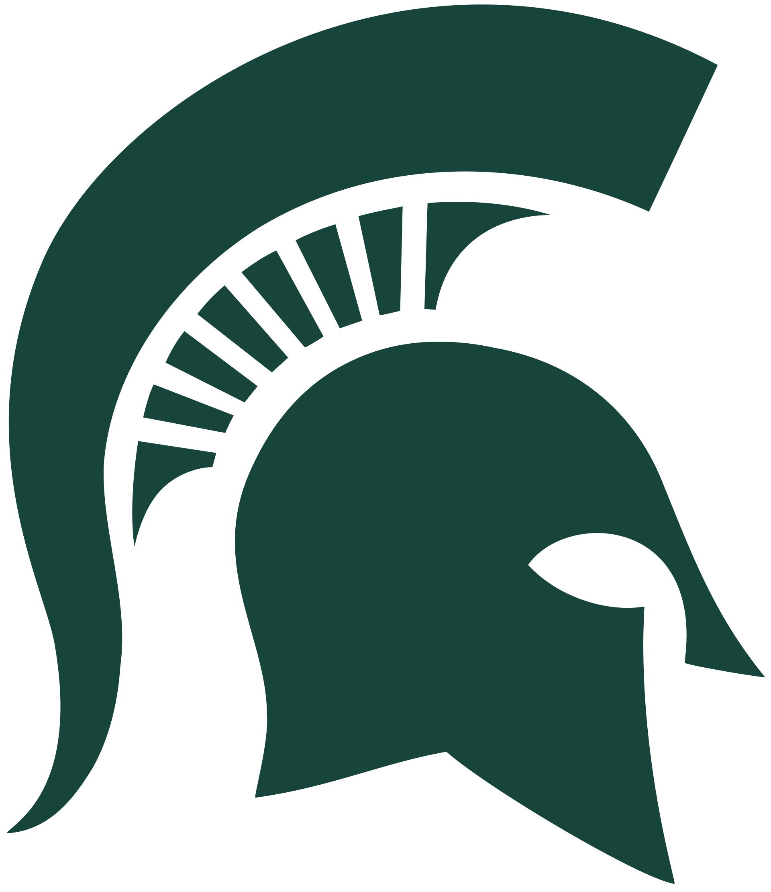

# CMSE 101: Learning Goals Planning Workshop

## Michigan State University - CMSE
### July 2, 2025

---

# **What is CMSE 101? (Preliminary)**

## 🎯 **Working Course Vision**
- **General education course** in data science, ML, and AI (Fall 2026)
- **Target**: non-STEM majors (business, humanities, social sciences)
- **Minimal prerequisites**, no programming experience
- **Goal**: develop informed citizenship in AI-driven world

**But what should this actually look like? That's what we're here to figure out!**

---

# **Workshop Goals**

## 🧠 **Today's Work**
- **Develop learning goals** collaboratively
- **Question our assumptions** about student needs
- **Brainstorm approaches** for diverse backgrounds
- **Test preliminary ideas** against reality
- **Leave with concrete next steps**

---

# **Starting Point: Preliminary Ideas**

## 🤔 **Some Initial Thoughts (To Be Tested!)**
- Focus on **"data in" to "model out"** workflow
- Emphasize **AI in everyday life** recognition
- Develop **critical thinking** about benefits and harms
- Use **familiar technologies** as entry points
- Address **bias and societal implications**

**But are these the right priorities? What's missing?**

---

# **Learning Goals Development Process**

## 🔄 **Our Workshop Flow**
1. **Individual reflection** (5 min) - What should citizens know about AI?
2. **Small group brainstorming** (15 min) - Generate learning goals
3. **Gallery walk & dot voting** (10 min) - Identify priorities
4. **Whole group discussion** (15 min) - Refine and organize

---

# **Activity 1: Individual Reflection**

## 🤔 **Think About This Scenario**
*A business student takes CMSE 101. Three years later, they're implementing AI chatbots at work.*

**What from this course should help them:**
- Understand what's happening "under the hood"?
- Ask good questions about bias and fairness?
- Communicate with technical teams?
- Make ethical decisions about AI use?

**Write 3-5 learning goals** (5 minutes, individual work)

---

# **Thought Starters**

## 💭 **Some Questions to Consider**
- What **familiar AI tools** could be entry points? (Spotify, Google)
- How do we teach **"cui bono?"** - who benefits from AI systems?
- What does **bias** mean to a non-technical student?
- How much **technical depth** vs. **critical thinking**?
- What **real scenarios** would resonate with diverse majors?

**Use these to spark ideas, but don't feel constrained by them!**

---

# **Activity 2: Small Group Brainstorming**

## 🧠 **Expand the Vision** (15 minutes)
**In groups of 3-4:**
1. **Share individual ideas** - what did everyone come up with?
2. **Build on each other** - what combinations or extensions emerge?
3. **Think about different contexts:**
   - A social work student using AI in case management
   - An art student encountering AI-generated content
   - A business student analyzing market data
4. **Write each potential learning goal** on a sticky note

---

# **Activity 3: Gallery Walk & Prioritization**

## 📝 **Organize Our Thinking** (10 minutes)
1. **Post sticky notes** under categories:
   - **Technical Understanding** - how AI works
   - **Critical Analysis** - evaluating AI systems
   - **Personal Application** - connecting to lives/values
   - **Other** - goals that don't fit above

2. **Gallery walk** - read everyone's ideas
3. **Dot voting** - 5 dots each for most important goals

---

# **Activity 4: Refining & Reality Check**

## 🎯 **Making It Work** (15 minutes)
**Looking at our top-voted goals:**
1. **Can we teach this** without prerequisites?
2. **Will students care** about this?
3. **Is this feasible** in one semester?
4. **How would we assess** this?

**Work together to:**
- Refine language of top goals
- Identify potential challenges
- Suggest concrete activities that could support each goal

---

# **Course Structure Planning**

## 📅 **How Should We Organize the Semester?**
**With our learning goals in mind:**
- **What sequence** makes sense for building understanding?
- **How many modules** can we realistically cover?
- **What familiar technologies** could anchor each module?
- **How do we reinforce** key concepts throughout?

---

# **Module Design Brainstorm**

## 🧩 **Potential Module Structure**
**Each 2-3 week module could include:**
- **Familiar technology** as entry point (e.g., Netflix)
- **Technical concepts** (how does this work?)
- **Critical analysis** (who benefits? concerns?)
- **Hands-on exploration** (accessible tools, no coding)
- **Reflection** to students' lives and values

**What modules would serve our learning goals?**

---

# **Activity 5: Module Brainstorming**

## 📋 **Design the Semester** (20 minutes)
**In small groups, each take one potential module:**
1. **Choose a familiar technology** as the anchor
2. **Map it to learning goals** - what would students learn?
3. **Sketch activities** - how would they engage?
4. **Identify challenges** - what would be hard to teach?
5. **Consider sequencing** - where does this fit in the semester?

**Potential modules: Social Media, Search, Recommendations, Generative AI, Healthcare AI, etc.**

---

# **Module Sharing & Sequencing**

## 🔗 **Putting It Together**
**Each group presents their module (3 min each):**
- **Technology focus** and student connection
- **Key learning goals** addressed
- **Proposed activities** and assessments
- **Prerequisites** from other modules

**Then we'll work together to:**
- **Sequence the modules** logically
- **Identify gaps** in coverage
- **Consider the semester arc**

---

# **Next Steps: Course Development**

## 🚀 **What We Accomplished Today**
- Generated learning goals collaboratively
- Identified priorities and challenges
- Brainstormed potential course modules
- **Now what?**

## 📋 **Moving Forward**
- **Synthesize today's work** into draft learning goals
- **Develop detailed module plans** based on today's ideas
- **Plan follow-up meetings** for instruction and assessment

---

# **Take Action: Before Next Meeting**

## 📝 **Individual Tasks**
1. **Reflect on today** - what resonated? What concerns you?
2. **Explore one module topic** - find examples, try tools
3. **Think about your students** - what would engage them?

## 🤝 **Group Tasks**
- **Document today's outcomes**
- **Schedule follow-up** for instruction & assessment
- **Research** similar courses at other institutions
- **Begin drafting** module outlines
