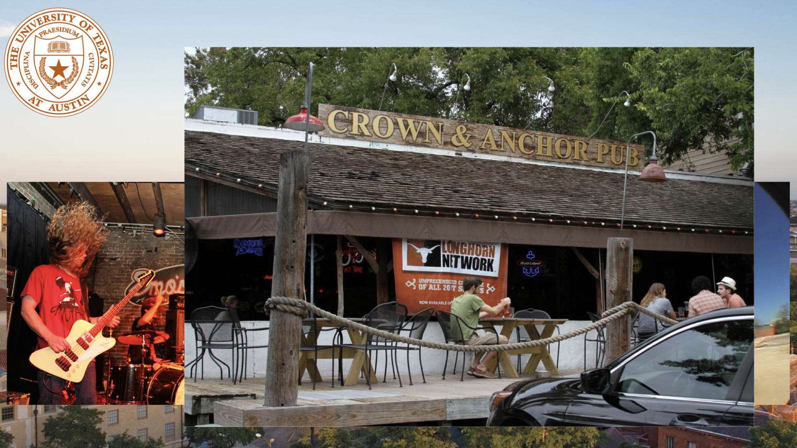
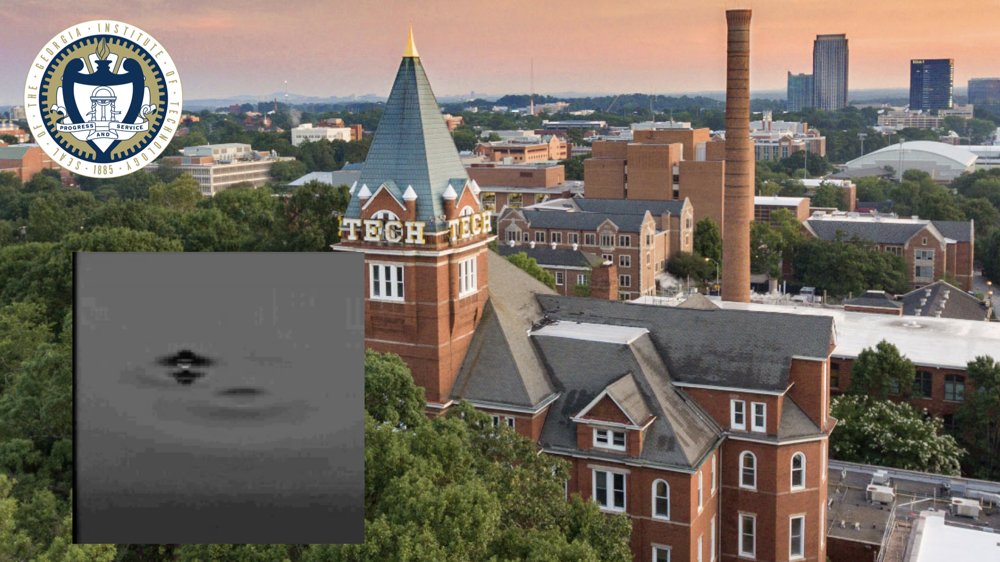

# Research: What, Why, and How

## Danny Caballero (he/they)
- Lappan Phillips Professor of Physics Education
- Union of Tenure System Faculty Organizer

Pilot-wave Hydrodynamics $\longrightarrow$ 

---

---

---

---

---

---

---

---

---

---

---

---

---

---

---

---

---

---

# What is research?

## Take 2-3 minutes and talk with your neighbors about what research is to you.

* What characteristics does research have?
* What are the goals of research?
* What are the outcomes of research?

---

# Why do folks do research?

## Take 2-3 minutes and talk with your neighbors about why folks do research.

* What motivates people to do research?
* What are the benefits of doing research?
* What are the drawbacks of doing research?

---

# Michigan State University

## MSU is a "research-intensive" university (R1 school)

* Most faculty are expected to do research
* We are expected to mentor graduate and undergraduate students in research
* We are expected to secure funding for our research
* We are expected to publish our research

## Why?

---

# Why does MSU do research?

For all the reasons you discussed and,

1. Conducting research is a way to advance knowledge
2. Applications of research drive economic development
3. Clout and prestige come with high-quality research
4. Research is a way to attract students and faculty
5. **Research pays the bills** $\longleftarrow$ *More on this later*

---

# My research

---

# How do you find research to do?

**Let's focus on research at MSU for now**

- **Departmental websites** - many departments have a list of research groups and centers; find the ones that interest you
- **Faculty websites** - many faculty have their own websites and they often list their research interests; find someone whose work interests you
- **Other researchers** - talk to your friends, classmates, and professors about their research; they might know of opportunities
- **Seminars and colloquia** - attend talks, go with classmates, and ask questions; you might find a research area or group that interests you

*Folks are often looking for help with research; however, some faculty are oversubscribed.*

---

# Getting in contact with faculty

Much of what I'm telling you available from the [SPS Careers Toolbox](https://www.spsnational.org/sites/all/careerstoolbox/) and is summarized on one of [my class websites](https://dannycaballero.info/phy321msu/resources/finding-research.html). 

- Find 3 faculty from the department or program that you are interested in working with
- Research their field of study; look at their recent publications or presentations
- Try to develop an understanding of their research and why it interests you
- Compose an email to the faculty member expressing your interest in their research and why you are interested

Big thanks to Profs. [Vashti Sawtelle](https://lbc.msu.edu/about/directory/sawtelle.html) and [Rachel Henderson](https://directory.natsci.msu.edu/Directory/Profiles/Person/102178) for their work to bring this into our physics classes at MSU.

---

# Drafting an email

1. First introduce yourself.
2. Explain why you’re emailing them about THEIR research.
3. What do you want from them?
4. What is your availability? 
5. Why should they pick you? 
6. Attach your resume!
7. REVIEW your writing! 
8. Hit SEND! 

<!--- # Presenter Notes  --->

<!-- First introduce yourself. Address the Professor “Dear Professor So-and-so”. In just a sentence or two, you should mention your name, year, and major. Keep it simple! “My name is Oski Bear, and I’m a freshman majoring in ____.”

Explain why you’re emailing them about THEIR research. Here, you need to show that this isn’t just-another-research-email. You should use the work you did in Part A to provide some good evidence that you’ve at least looked them up! “I was looking at your website and found the idea behind your ongoing project on [x] to be very [x].” You don’t need to be CRAZY specific — you just need to show them that you have a genuine interest in what they do.

What do you want from them? Here, it’ll usually just be “any available position in your lab.” Modify it as necessary. You’ll also need to touch on the timing of this position. Are you looking for a fall position? A spring position? If you’re already thinking about the summer, you can mention that here too!

What is your availability? A general rule of thumb is to have 8-10 hours free in your schedule if you want to add on a research position. You should let the professor know how many hours you’re willing to dedicate to the position, and sometimes they’ll actually ask to see your semester schedule. If the professor has office hours, say you plan to come to their office hours on X day. If they don’t have office hours, request a meeting, and describe your availability for the next week or so. “I’m generally free Tuesday and Thursday afternoons as well as Friday mornings”. That way the professor, with a single email, can give you an appointment time.

Why should they pick you? This is a little tricky, since you might not necessarily have prior research experience. That’s okay though! Think about what you’ve done that could demonstrate that you are a strong candidate. Challenging coursework? Genuine curiosity? You can also rephrase a lack of experience as motivation to learn, telling the professor that regardless of your lack of experience, your deep motivation to grow and learn would make you a dedicated and hardworking member of their team.

Attach your resume! Attach it to the email, and mention you’ve included it: “I’ve attached my resume…”.

REVIEW your writing! Set up an appointment with Danny to review your email and to make sure the tone is professional, that the closing is appropriate, etc.

Hit SEND! Students get research positions all the time because they asked. Now that you’ve drafted that email – consider sending it out to the 3 faculty members you identified in Part A! -->

---

# Following up vs. moving on

- Professors do the job differently; some might not respond
- If you don't hear back in a couple of weeks, send a follow-up email
- If you don't hear back after that, move on to the next faculty member
    - You had a list of three, right?

---

# What should you look for in a research group?

**Every research group and mentor is different.**

- A group that is doing work that interests you
- A group that acts with integrity and respect
- A group that is supportive of you and your goals
- A mentor that you can work with and learn from
- A mentor that is transparent and honest with you
- A mentor that is invested in your success and growth

---

# What should you expect from a research group?

**Expectations are personal and can vary widely.**

- A safe and inclusive environment
- A set of expectations and goals that are clear and achievable
- The resources and support you need to meet those expectations and goals
- A supportive and respectful mentor and group
- Opportunities to learn and grow as a researcher
- Opportunities to present/publish your work locally or nationally
- Opportunities to network and collaborate with other researchers

---

# What should a research group expect from you?

**Communication is critical to a successful research experience.**

- Regular attendance at group meetings and/or seminars
- Regular communication between you and your mentor(s)/group
- Regular updates on your progress and any challenges you are facing
- A willingness to learn and grow as a researcher
- A willingness to take on new challenges and responsibilities
- A willingness to ask for help when you need it

---

# What are the benefits (for you) of doing research?

- **Experience** - you will gain experience in research methods, data analysis, and scientific writing
- **Skills** - you will develop skills in critical thinking, problem-solving, and communication
- **Networking** - you will have the opportunity to meet and work with other researchers in your field
- **Mentorship** - you will have the opportunity to learn from experienced researchers and mentors
- **Confidence** - you will gain confidence in your abilities as a researcher and a scientist

**Job opportunities, career planning, strong letters of recommendation, and so on can be a huge benefit of doing research with a group for an extended period of time.**

---

# Questions, comments, concerns?

Email: <caball14@msu.edu>

---

---

# Research is under attack

## Stand Up for Science Rally (07 Mar 2025)

Source: <https://www.motherjones.com/politics/2025/03/stand-up-for-science-dc-trump-doge-cuts-climate-nobel-laureates-nih-march/>

---

# Resisting the Bullshit

## Danny Caballero (he/they)
- Lappan Phillips Professor of Physics Education
- Union of Tenure System Faculty Organizer

<!--- # Presenter Notes  --->

---

# Major Caveats

## My views do not represent the views of MSU, the College of Natural Science, or the Department of Physics and Astronomy

- I am not a lawyer
- My advice comes from personal experience
- You do not have to do anything I suggest
- You do not have to stay for this talk

<!--- # Presenter Notes  --->
<!--- I am only speaking for myself. --->
<!--- My experience and my knowledge are limited. --->

---

# What has happened?

## The president has issued and his administration are attempting to enforce several executive orders:

- Cancellation of anything DEI related
- Federal freeze on grants and loans; cuts to current NIH and NSF grants
- Stoppage of work at US AID, CPB, and other federal agencies
- Reversal of Title IX protections for women and LGBTQ+ individuals
- And so much more...

## These executive orders are callous, cruel, and dangerous.

<!--- # Presenter Notes  --->
<!--- You might feel differently about different orders -->
<!--- You might feel differently about the president's actions. --->
<!--- You might feel differently about the president. --->
<!--- That is all ok. --->
<!--- The impact of these orders is real and immediate. --->

---

# What has been the impact?

## Absolute chaos

<!--- # Presenter Notes  --->
<!--- Research and educational programs are being cut. --->
<!--- Grants are being frozen or canceled. --->
<!--- Universities use federal funding to support their programs. --->
<!--- Tuition is not enough to support the programs and will go up. --->
<!--- Not to mention the chilling effect on research and education. --->

---

# A few things to remember

## Our collective power is our greatest strength

- You are not alone in any of your feelings; we are all in this together
- You don't have to agree with everything I say to be a part of this community; you are welcome here
- Again, you don't have to do anything I suggest

## It will take time for the courts to sort this out

<!--- # Presenter Notes  --->
<!--- I want to be very clear on my position. --->
<!--- I don't take kindly to bullying and I don't take kindly to bullies. --->

---

# Attacks on women, folks of color, the LGBTQ+ community, and immigrants are attacks on all of us

## We must stand together to resist these attacks

## Sexism, racism, homophobia, transphobia, and xenophobia have no home here

## These EOs are attacks on our humanity and designed to divide us

<!--- # Presenter Notes  --->
<!--- This is my personal and strongly held belief. --->

<!-- ---

# Things you will learn today

## How to resist the bullshit

- What your rights are when interacting with law enforcement
- Tools and strategies for ensuring your rights are respected and your safety is maintained
- How to support your friends and colleagues who might be targeted
- How to activate yourself, your friends, and your family against these attacks
- That you have a resource in me anytime you need it

<!--- # Presenter Notes  --->
<!--- My anxiety and anger are real. --->
<!--- They push me to action and organizing. --->
<!--- Your actions don't have to be the same as mine. --->

<!-- ---

# Know that some of us avoid interactions with law enforcement because we have been taught to

- My experience is not yours and yours is not mine
- We all have different experiences with law enforcement
- Some of your friends might be incredibly uncomfortable around law enforcement

## Know your rights (ACLU.org)

<https://www.aclu.org/sites/default/files/field_toolkit_file/kyr_english_3.pdf> -->

<!--- # Presenter Notes  --->
<!--- Tell them about your interactions with law enforcement. --->
<!--- Remind them about targeting of people --->
<!--- Remind them some departments are better than others. --->
<!--- ELPD is a good department. --->

<!-- ---

# The Fourth Amendment

> The right of the people to be secure in their persons, houses, papers, and effects, against unreasonable searches and seizures, shall not be violated, and no Warrants shall issue, but upon probable cause, supported by Oath or affirmation, and particularly describing the place to be searched, and the persons or things to be seized.

Plainly, you have the right to be free from unreasonable searches and seizures. Law enforcement has limited authority to search you, your home, or your belongings.

Source: <https://constitutioncenter.org/the-constitution/amendments/amendment-iv/interpretations/121> -->

<!--- # Presenter Notes  --->
<!-- 
---

# Interactions with Law Enforcement

## "I don't have anything to say. I don't consent to be searched."

If you are approached by law enforcement, you have the right to remain silent

- You do not have to answer any questions
- You do not have to show ID
- You do not have to consent to a search
- You do not have to open your door
- You do not have to do anything without a **warrant signed by a judge** -->

<!--- # Presenter Notes  --->
<!--- Cops are very good at getting you to talk to them. --->
<!--- They are seeking your consent to search you, your car, your home, etc. --->

<!-- ---

# Immigration and Customs Enforcement

## "I don't have anything to say. I'm asking you to leave."

If you are approached by ICE, you have the right to remain silent

- ICE cannot enter your home without a warrant signed by a judge
- MSU classrooms, research spaces, and offices are not public spaces
- ICE cannot enter these spaces without a warrant signed by a judge

Red cards are available from the Immigrant Legal Resource Center 
<https://www.ilrc.org/red-cards-tarjetas-rojas> -->

<!--- # Presenter Notes  --->
<!--- Cops are very good at getting you to talk to them. --->
<!--- They are seeking your consent to search you, your car, your home, etc. --->
<!-- 
---

# Red Card

## Print some and keep them handy

- Explains your rights in multiple languages. 
- Can be handed to law enforcement without opening a door.

- # Presenter Notes  - -->

---

# MSU will not respond publicly

- MSU is a public institution
- MSU must respond to Freedom of Information Act (FOIA) requests
- MSU has already received FOIA requests 

## University leadership will not speak out publicly

- Read their emails carefully
- Read the reporting thoroughly
- You are not alone

<!--- # Presenter Notes  --->
<!--- MSU's legal exposure and financial exposure are real. --->
<!--- The advice leadership receives is to limit exposure. --->
<!--- They are communicating their support, but it's not being made prominent. --->

---

# How can you advocate for MSU to protect its students, faculty, and staff?

## You should not be muzzled

## You have the right to speak out

## You have the right to organize

<!--- # Presenter Notes  --->
<!--- If you are a citizen, you enjoy the full rights and protections of the Constitution. --->
<!--- You are not subject to financial and legal exposure like MSU -->
<!--- You are not subject to the same scrutiny as MSU. --->
<!--- You can organize and advocate for your rights. --->

---

# What can we do?

## We need to be loud

## We need to be visible

## We need to be organized

# We need to do BIG. PUBLIC. SHIT.

<!--- # Presenter Notes  --->

---

# Actions we can take

1. **Teach-Ins** $\leftarrow$ **We are doing this right now.** - Our job is to educate and that is not just within our disciplines. Teaching about the impact of federal freezes on research in science, humanities, and health. Helping students to learn their rights, how to advocate for their needs, and how to communicate with public officials are all things we can do. Explaining how the [arc of the American trajectory towards democracy, equality, and inclusion has been long and hard fought](https://danny.hellmo.space/posts/our-division-has-been-engineered/) and is now under attack. 
2. **Rallies** - [MSU has 52,000 students, nearly 6,000 academic staff, and more than 7,000 administrative staff](https://en.wikipedia.org/wiki/Michigan_State_University). That's 65,000 people! All of us are going to be affected if these attacks continue. If even 2% of us rally, that's still 1,300 people.

<!--- # Presenter Notes  --->

---

# Actions we can take

3. **Letter Writing Campaigns** - One of the most effective ways to communicate with our elected officials is to [write them](https://danny.hellmo.space/posts/writing-your-congressperson/).  Your congressperson might not share your views ([mine sure doesn't](https://barrett.house.gov/)), but they still represent you. You can make it hard for them to dodge your message. you can make it difficult to ignore you. You can get them to say what they mean. Writing these kinds of letters is a skill that we can all learn, and we can teach it to others. 
4. **Door-to-Door Advocacy** - Knocking doors is no joke. I did it for the successful campaign for [Michigan Proposal 3](https://ballotpedia.org/Michigan_Proposal_3,_Right_to_Reproductive_Freedom_Initiative_(2022)) to restore reproductive rights to all of those who needed to enjoy those rights. It's hard to talk to people you don't know, but it's important if we want to make change. We can do this in our communities, in our neighborhoods, and elsewhere. 

<!--- # Presenter Notes  --->

---

# Writing a letter to your congressperson

**You must be an American citizen and a constituent of the congressperson to write them.**

1. **Find out who your congressperson is.** 
    - <https://www.congress.gov/members/find-your-member>
2. **Research their views, and votes.**
    - Views: Search: *<Rep. Name's> view on <issue>*
    - Votes: <https://clerk.house.gov/Votes>
3. Read how to write your congress person.
   - [How to get your congressperson to hear you](https://www.publicsource.org/how-to-get-your-congressperson-to-actually-hear-you/)
   - [Writing your congressperson](https://danny.hellmo.space/posts/writing-your-congressperson/)

**Your letter is limited to 2000 characters, but you can call and read it.**

<!--- # Presenter Notes  --->

---

# Writing a letter to your congressperson

1. Start with an introduction and **be specific**. Include your ask. Include how the member represents you. Ensure you **offer a rationale aligned with your member's interests**.
2. Quickly **move to your request** and reference government documents. News reports can be helpful. **Avoid using language that indicts the order if the member does not share your views**. Instead, think about how important this work should be to your member. What about your work impacts them and their interests? **Remind them of the material impacts.**

<!--- # Presenter Notes  --->

---

# Writing a letter to your congressperson

3. Get specific and **provide examples of the present impact and potential future impact** should the course be stayed. **Remind them again why they should care** about this issue.
4. Close with a **thank you and a clear ask for a response**.
5. Then just **sign your name and provide your contact information**.

<!--- # Presenter Notes  --->

---

# Finally

## Thank you for sharing the space.

## Thank you for listening.

## This is temporary if we make it so.

<!--- # Presenter Notes  --->

---

# Questions, comments, concerns?

Email: <caball14@msu.edu>

<!--- # Presenter Notes  --->
<!--- Remind them that they are not alone.  -->

