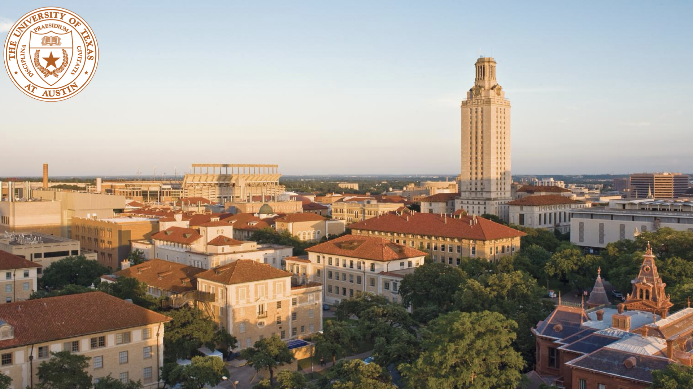
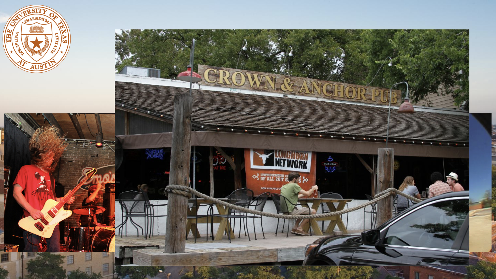
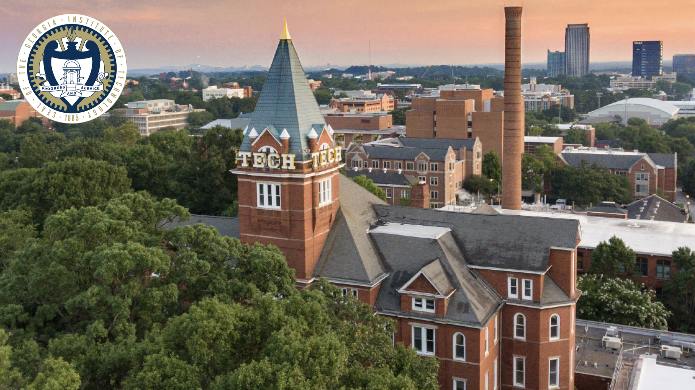
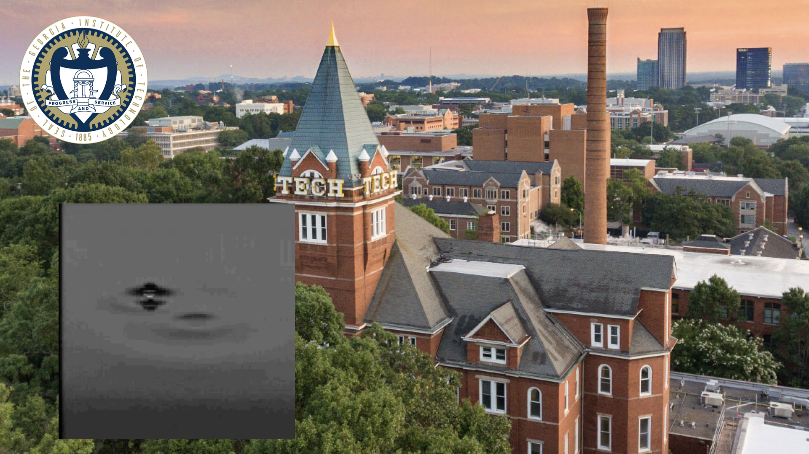
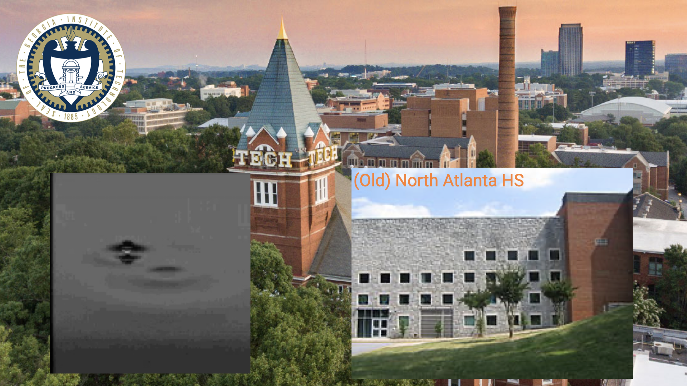
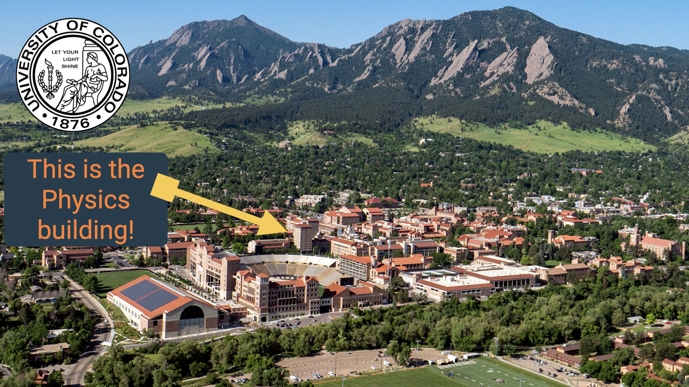
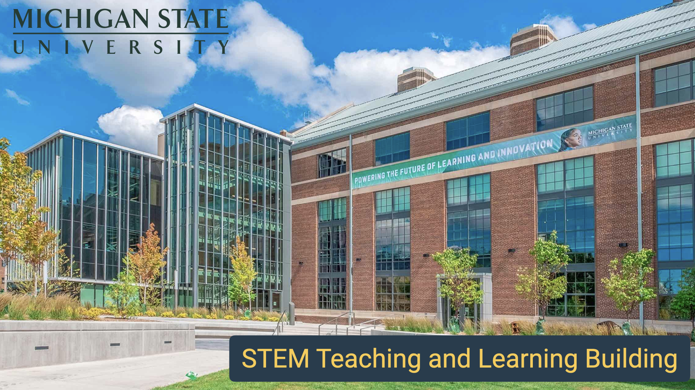

# Integrating Computing into Physics Curricula
## Danny Caballero (he/they)
Lappan Phillips Professor
- Department of Physics and Astronomy
- Department of Computational Mathematics, Science, and Engineering
- CREATE for STEM Institute
### Michigan State University

---

---

---

---

---

---

---

---

---

---

---

---

---

---

---

---

